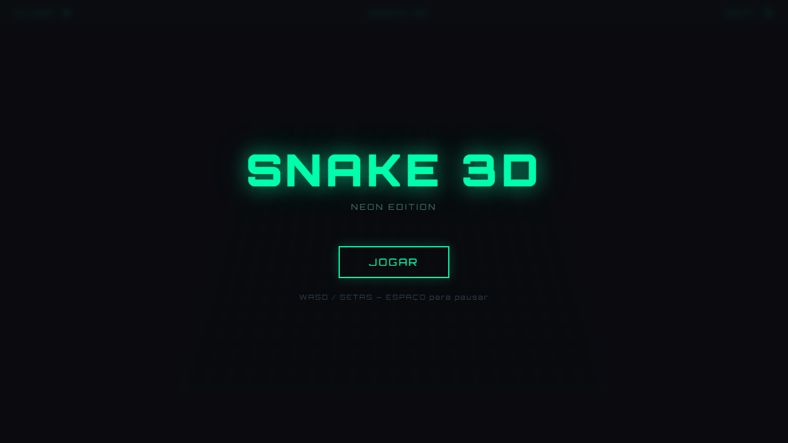
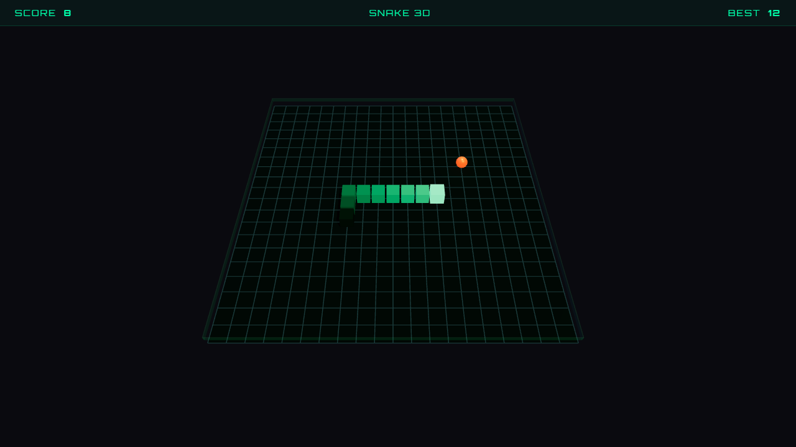
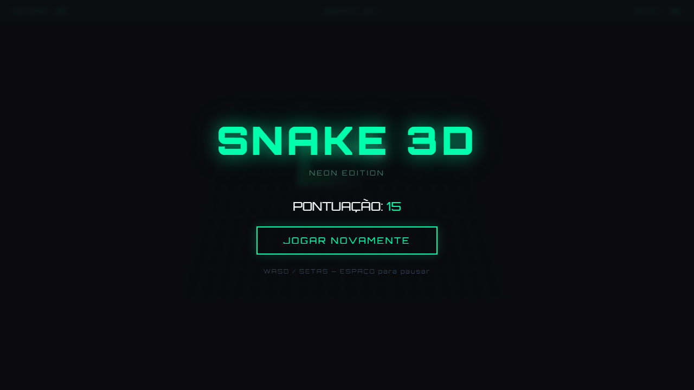

# Snake 3D — Neon Edition

Uma releitura moderna e tridimensional do clássico jogo Snake, desenvolvida inteiramente em um único arquivo HTML com Three.js e WebGL.

## Screenshots

### Tela Inicial

### Gameplay

### Game Over

## Como jogar

Abra o arquivo `snake3d.html` em qualquer navegador moderno — nenhuma instalação necessária.

| Tecla | Ação |
|-------|------|
| `W` / `↑` | Mover para cima |
| `S` / `↓` | Mover para baixo |
| `A` / `←` | Mover para a esquerda |
| `D` / `→` | Mover para a direita |
| `Espaço` / `P` | Pausar / Retomar |

## Funcionalidades

- Renderização 3D com **Three.js** e iluminação dinâmica (sombras, fog, emissive glow)
- Cobra com gradiente de cores do verde neon ao verde escuro
- Comida com efeito de pulso e luz pontual laranja
- Velocidade progressiva — fica mais rápido a cada 5 pontos
- Placar com melhor pontuação salvo durante a sessão
- Bordas luminosas no grid indicando os limites do mapa
- Fonte **Orbitron** para a estética cyberpunk/neon

## Tecnologias

- HTML5 + CSS3
- JavaScript (ES Modules)
- [Three.js](https://threejs.org/) r160 via ESM

## Como foi gerado

Este projeto foi criado com **Claude Code** como parte do curso **Engenheiro de Agentes IA** da Asimov Academy.
